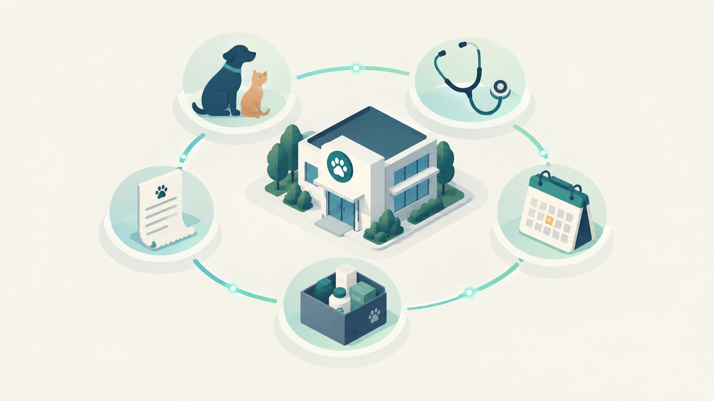

  

<h1 align="center">VetCloud</h1>

<b>Sistema de gestión para clínicas veterinarias.</b>

> **Este repositorio es una presentación pública del producto.** Aquí
> encontrarás la visión, el alcance y el estado del proyecto.

## Qué es

VetCloud es una plataforma integral de gestión para clínicas veterinarias
en Colombia: pacientes, agendamiento, historia clínica, hospitalización,
inventario y facturación electrónica, en un solo sistema en vez de
Excel, WhatsApp y papel repartidos entre áreas.

## Qué incluye

- **Pacientes** — mascotas y propietarios, con búsqueda y perfil completo.
- **Agendamiento** — calendario diario y semanal, disponibilidad y estado
  de cada cita.
- **Historia clínica** — registro clínico inmutable y progresivo:
  diagnósticos, prescripciones, exámenes.
- **Hospitalización** — tablero de seguimiento por paciente hospitalizado,
  con medicación y alertas de urgencia.
- **Inventario** — productos, lotes, movimientos y alertas de stock.
- **Facturación** — pagos parciales, notas crédito, resumen financiero,
  con soporte para facturación electrónica (DIAN).
- **Administración** — usuarios, roles y configuración por clínica.

## Estado

**Construido y funcional**, con despliegue listo (Vercel + Railway).

## Sobre el proyecto

Construido por **Luis Restrepo** — bioingeniero y desarrollador full-stack
especializado en IA aplicada a salud.

[LinkedIn](https://www.linkedin.com/in/luiscarlosrestrepogallego317) ·
[clrestrepo8@gmail.com](mailto:clrestrepo8@gmail.com)

---

*¿Tienes o gestionas una clínica veterinaria y esto resuena con un
problema que tienes? Escríbeme.*
